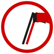

# Neto Vasconcellos

**A prática como critério da verdade** &nbsp;☭

*Pessimismo da razão, otimismo da vontade*

`Curitiba · PR · Brasil`

---

Construo sistemas com IA que resolvem problemas reais — de plataformas SaaS a presença digital para pequenas empresas e ONGs. Fundador do **Sagaz Lab**, trabalho na interseção entre automação, produto e impacto.

## Projetos

| Projeto | O que é | Stack |
|---|---|---|
| [**Sagaz Lab**](https://sagazlab.io) | Estúdio de presença digital e automação para PMEs | HTML/CSS/JS · n8n · MariaDB · Nginx |
| [**Presença Digital**](https://presenca.sagazlab.io) | Site + Google + redes + automações para PMEs | HTML/CSS/JS · Nginx |
| [**kengbraga.com**](https://kengbraga.com) | Site de autoridade para coach executivo | HTML/CSS/JS · Nginx |
| [**Don Maths**](https://sagazlab.io/donmaths/) | Site oficial do músico e DJ — trilíngue PT/EN/ES | HTML/CSS/JS · Nginx |
| **ACRICA Digital** | Gestão digital para coletivo cultural — pro bono | n8n · MariaDB · HTML/CSS/JS |
| **Virado na Gota** | Transformação digital para ONGs invisíveis | Em construção · jul/2026 |

## Stack

## Certificações

---

🏴&nbsp;🚩 &nbsp;&nbsp; *Quer conversar sobre IA, produto ou organização?* &nbsp; [LinkedIn](https://www.linkedin.com/in/netovng/) · [sagazlab.io](https://sagazlab.io)

