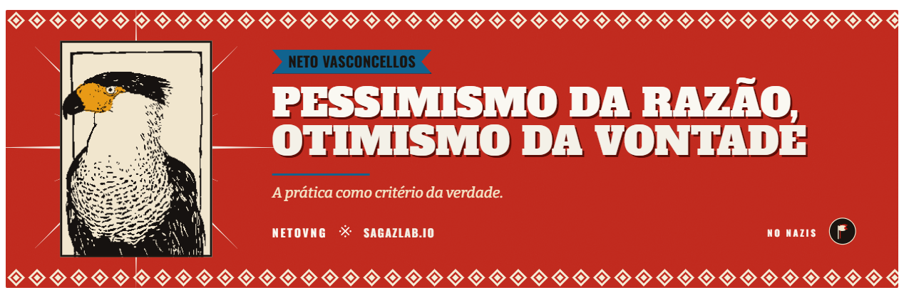

<!-- ─────────────────────────────────────────────────────────────
     NETO VASCONCELLOS · README de perfil
     Layout inspirado no mockup de perfil (agosto/2026), convertido
     para markdown. Números "vivos" (repos, seguidores, contribuições)
     são widgets dinâmicos — nada de valor chumbado à mão.
     Banner em assets/hero/ · gravuras em assets/animals/
     ───────────────────────────────────────────────────────────── -->

<picture>
  <source media="(prefers-color-scheme: dark)" srcset="assets/hero/banner.png">
  
</picture>

# Neto Vasconcellos

`NetoVNG · he/him`

**A prática como critério da verdade**

*Practice as the criterion of truth · building AI systems that solve real problems*

&nbsp;`Curitiba · PR · Brasil`

---

Construo sistemas com IA que resolvem problemas reais — de plataformas SaaS a presença digital para pequenas empresas e ONGs. Fundador do **Sagaz Lab**, trabalho na interseção entre automação, produto e impacto.

*I build AI systems that solve real problems — SaaS platforms and digital presence for small businesses and nonprofits. Founder of Sagaz Lab, working where automation, product and impact meet.*

## Operação · Sagaz Lab

<table>
<tr>
<td width="33%" valign="top">

🟢 **Presença**

SaaS comercial no ar. Landing, 12 templates e funil de captação ativo.

`presenca.sagazlab.io`

</td>
<td width="33%" valign="top">

🟡 **Virado na Gota**

Frente social do lab — transformação digital para ONGs invisíveis.

`em construção · 2026`

</td>
<td width="33%" valign="top">

🟣 **Carcará**

Consultoria acadêmica — redesign em andamento.

`sprint aberto`

</td>
</tr>
</table>

## Projetos

| Projeto | O que é | Stack | Status |
|---|---|---|---|
| [**Presença**](https://presenca.sagazlab.io) | Site + Google + redes + automação de atendimento para PMEs | `HTML/CSS/JS` · `n8n` · `Nginx` | Comercial · no ar |
| [**Sagaz Lab**](https://sagazlab.io) | Estúdio de presença digital e automação com IA | `HTML/CSS/JS` · `n8n` · `MariaDB` | Ativo |
| [**sixsigma_saas**](https://github.com/NetoVNG/sixsigma_saas) | Inteligência operacional Lean Six Sigma com IA e ISO 13053 | `Python` · `Next.js` · `FastAPI` | Público |
| [**Carcará**](https://carcara.sagazlab.io) | Consultoria acadêmica — parceria e redesign | `HTML/CSS/JS` · `n8n` | Redesign |
| **ACRICA Digital** | Gestão digital para coletivo cultural — pro bono | `n8n` · `MariaDB` · `HTML/CSS/JS` | Voluntariado |
| [**Virado na Gota**](https://viradonagota.com) | Transformação digital para ONGs invisíveis | a definir | Em construção |

## Stack

## GitHub em números

## Certificações

---

**Quer conversar sobre IA, produto ou organização?**

*Open to conversations about AI, product and digital presence for small teams and nonprofits.*

🏴 🚩 &nbsp; *Pessimismo da razão, otimismo da vontade.*

