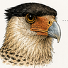

<!-- ─────────────────────────────────────────────────────────────
     NETO VASCONCELLOS · README de perfil
     Assets em assets/ — ver estrutura no fim do arquivo.
     ───────────────────────────────────────────────────────────── -->

<picture>
  <source media="(prefers-color-scheme: dark)" srcset="assets/hero/banner-v2.png">
  
</picture>

# NETO VASCONCELLOS

**Lean Six Sigma · Dados · IA · Automação · Software**

Transformo problemas operacionais em sistemas **mensuráveis, automatizados e escaláveis**.

[**Sagaz Lab →**](https://sagazlab.io) · [LinkedIn →](https://linkedin.com/in/netovng) · [contato@sagazlab.io](mailto:contato@sagazlab.io) · `Curitiba · PR · Brasil`

---

## Método

<table>
<tr>
<td width="33%" valign="top">
 
<b>CARCARÁ</b> 
Observar · medir · compreender  
Antes de escrever qualquer linha, entender o processo que gera o problema.
</td>
<td width="33%" valign="top">
<b>MÉTODO</b> 
Diagnosticar · experimentar · melhorar  
DMAIC aplicado a software: causa raiz antes de solução, métrica antes de entrega.
</td>
<td width="33%" valign="top">
 
<b>TEXUGO-DO-MEL</b> 
Construir · testar · persistir  
O problema difícil é o único que vale automatizar. Ele não é abandonado.
</td>
</tr>
</table>

`razão → método → vontade` · `código como processo`

---

## Sobre

Atuo na interseção entre melhoria de processos, dados e desenvolvimento de software.
Uso **Lean Six Sigma** para diagnosticar, **IA e automação** para executar, e métrica para provar que a solução funcionou — em banco, em PME e em ONG.
Fundador do **Sagaz Lab**.

---

## Projetos em destaque

### SAGAZ SIGMA · SaaS — *inteligência operacional Lean Six Sigma com IA generativa*

|  |  |
|---|---|
| **Problema** | Projetos de melhoria morrem no Excel: dados dispersos, análise manual, DMAIC sem rastro. |
| **Solução** | Plataforma que conduz o ciclo DMAIC e usa IA para sugerir causa raiz e plano de ação. |
| **Stack** | `Python` `FastAPI` `React` `MariaDB` |
| **Resultado** | Frente mais ativa do estúdio; 1.300+ arquivos em desenvolvimento contínuo. |

[**Conhecer o projeto →**](https://sagazlab.io)

### PRESENÇA — *site, Google, redes e automação de atendimento para PMEs*

|  |  |
|---|---|
| **Problema** | Negócio local não é encontrado, e o pouco contato que chega se perde no WhatsApp. |
| **Solução** | Presença padronizada + captação e triagem de leads automatizadas, replicável por cliente. |
| **Stack** | `HTML/CSS/JS` `n8n` `Nginx` |
| **Resultado** | Base do produto Prospecção Presença, hoje com 5 prospects em DMAIC ativo. |

[**Ver caso →**](https://presenca.sagazlab.io)

### VIRADO NA GOTA — *transformação digital para ONGs invisíveis*

|  |  |
|---|---|
| **Problema** | ONGs pequenas não têm presença digital nem processo — ficam invisíveis para quem poderia apoiar. |
| **Solução** | Diagnóstico + digitalização pro bono, reaplicando o método de Presença e Sagaz Sigma. |
| **Stack** | `n8n` `MariaDB` |
| **Resultado** | Em construção — primeira ONG-piloto do programa. |

[**Ver caso →**](https://viradonagota.com)

<b>Outros projetos</b>

 

| Projeto | O que resolve | Stack |
|---|---|---|
| Sagaz Public | Site institucional do Sagaz Lab | `React` `n8n` |
| [Zuppa Agency](https://zuppa.agency) | Site + captação automatizada para agência criativa | `n8n` `MariaDB` `Nginx` |
| Don Maths | Site oficial do músico e DJ — trilíngue PT/EN/ES | `HTML/CSS/JS` `Nginx` |
| ACRICA Digital | Gestão digital para coletivo cultural — pro bono | `n8n` `MariaDB` |
| O Grão | Site + storyboards de conteúdo para cliente | `React` |

---

## Competências

*Processo + dados + tecnologia — nessa ordem.*

<table>
<tr>
<td width="33%" valign="top">
<b>PROCESSOS</b>  
Lean Six Sigma 
DMAIC 
Análise de causa raiz 
Desenho de processos 
Melhoria contínua
</td>
<td width="33%" valign="top">
<b>DADOS</b>  
Python 
SQL 
Power BI 
Visualização 
Análise estatística
</td>
<td width="33%" valign="top">
<b>TECNOLOGIA</b>  
IA / LLMs e agentes 
Automação (n8n, APIs) 
Next.js · React 
FastAPI · Supabase 
Docker · Nginx
</td>
</tr>
</table>

---

## Certificações

| Credencial | Emissor |
|---|---|
| **Lean Six Sigma Black Belt** | FM2S |
| **Lean Six Sigma Green Belt** | FM2S |
| **Data Visualization · Power BI** | Visionário |
| **Inovação** | Banco do Brasil · 2024 e 2025 |

## Stack

`Python` `TypeScript` `Next.js` `FastAPI` `n8n` `Claude API` `Supabase` `Docker`

O resto aparece dentro do projeto onde foi usado.

---

### Tem um processo que dói?

Diagnóstico é conversa. Escreva: [contato@sagazlab.io](mailto:contato@sagazlab.io) · [LinkedIn →](https://linkedin.com/in/netovng) · [sagazlab.io →](https://sagazlab.io)

<i>Pessimismo da razão, otimismo da vontade.</i>

<!-- ─────────────────────────────────────────────────────────────
ESTRUTURA DE ASSETS

assets/
├── hero/            banner.png · banner-light.png     1268×415
├── animals/         carcara-96.png · texugo-96.png    96×96 (+ -192 @2x, + prancha completa)
├── sections/        metodo.png                        1600×420 @2x
├── projects/        <slug>-card.png                   1200×520 @2x
├── icons/           rule.svg                          1200×12
└── certifications/

Paleta: #C4342A vermelho tinta · #8E1F16 vermelho fundo · #F2E8D5 papel
        #14110F preto tinta · #E8734A ocre (apenas texto em dark mode)

Regra de acessibilidade: nenhuma informação profissional existe apenas
dentro de imagem — todo texto de card também está em Markdown acima.
───────────────────────────────────────────────────────────── -->
